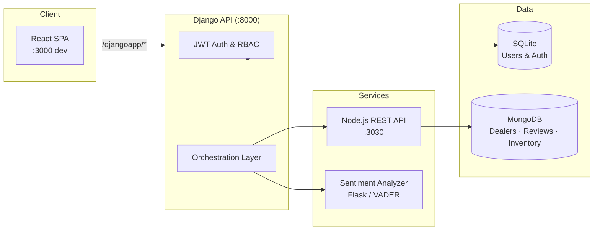

# Autocars UG

**Empowering Ugandan dealerships with secure, role-aware vehicle management and intelligent customer feedback.**

Autocars UG is a full-stack capstone platform that connects **System Admins**, **Dealer Admins**, and **Customers** across a modern React SPA, a Django security and orchestration layer, and a Node.js/MongoDB data API. Dealerships manage inventory and profiles; customers discover dealers and leave reviews enriched with **VADER sentiment analysis**—all governed by JWT authentication and fine-grained role-based access control (RBAC).

---

## Table of Contents

- [Features](#features)
- [Architecture](#architecture)
- [Tech Stack](#tech-stack)
- [Project Structure](#project-structure)
- [Prerequisites](#prerequisites)
- [Installation](#installation)
- [Configuration](#configuration)
- [Running the Application](#running-the-application)
- [Testing](#testing)
- [API Overview](#api-overview)
- [Roadmap](#roadmap)
- [License](#license)

---

## Features

### System Admin (`ADMIN`)

Platform operators with full governance capabilities:

- **Create Dealer Admins** — onboard dealership managers with a required `assignedDealerId` tied to a live dealership in MongoDB.
- **Cross-tenant visibility** — read and update any dealership profile; moderate reviews platform-wide.
- **Protected admin routes** — `/admin/dashboard`, `/admin/create-dealer-admin` behind JWT + role guards.

### Dealer Admin (`DEALER_ADMIN`)

Dealership-scoped operators linked to a single `assigned_dealer_id`:

- **Dashboard** — overview of assigned dealership metrics and quick links.
- **Inventory management** — add, update, and delete vehicles for *their* dealership only.
- **Profile management** — update dealership details (name, address, contact) for the assigned location.
- **Review inbox** — read customer feedback for their dealership (no self-review posting).

### Customer (`CUSTOMER`)

Public and authenticated end-user experiences:

- **Browse dealerships** — search and filter dealers by state; view dealer detail pages.
- **Post reviews** — submit ratings and text for a dealership (sentiment computed on write).
- **My Reviews** — `/customer/my-reviews` lists only the signed-in user's reviews with search and filters.
- **Public discovery** — browse all reviews on `/reviews` without logging in.

### Cross-cutting capabilities

| Capability | Description |
|------------|-------------|
| **JWT auth** | Access + refresh tokens; session stored client-side; `authHeaders()` on protected API calls |
| **RBAC guards** | React `RequireAuth`, `RequireRole`, and `RoleRedirect` enforce route-level access |
| **Sentiment analysis** | VADER-based microservice; neutral fallback when analyzer is unavailable |
| **Ownership enforcement** | Dealer admins cannot mutate other dealers' inventory or profiles |
| **Autocars UG branding** | Tailwind design system, shared layouts, and consistent navigation |

---

## Architecture



**Request flow (example — post a review):**

1. Customer submits a review in the React app.
2. Django validates the JWT, checks `CUSTOMER` or `ADMIN` role, and forwards the payload to the Node API.
3. Django calls the sentiment analyzer and attaches `sentiment` to the response.
4. MongoDB persists the review; the enriched result returns to the client.

---

## Tech Stack

### Frontend (`frontend/`)

| Technology | Purpose |
|------------|---------|
| **React 18** | Component-based SPA |
| **React Router v6** | Protected routes, layouts, role redirects |
| **Tailwind CSS 3** | Utility-first styling and design tokens |
| **PostCSS / Autoprefixer** | CSS pipeline |
| **Jest + React Testing Library** | Unit and integration tests |
| **sessionStorage** | JWT and user profile persistence |

### Django layer (`djangoapp/`, `djangoproj/`)

| Technology | Purpose |
|------------|---------|
| **Django 4.2** | API gateway, auth, RBAC enforcement |
| **PyJWT** | Access / refresh token issue and validation |
| **SQLite** | Custom `User` model (roles, `assigned_dealer_id`) |
| **python-dotenv** | Environment configuration |
| **requests** | Upstream calls to Node API and sentiment service |

### Node.js data API (`database/`)

| Technology | Purpose |
|------------|---------|
| **Node.js 18+** | Express REST server |
| **MongoDB / Mongoose** | Dealerships, reviews, vehicle inventory |
| **Docker Compose** | Local MongoDB + API containers |
| **CORS** | Cross-origin access from Django and React |

### Databases & services

| Store / Service | Responsibility |
|-----------------|----------------|
| **SQLite** (`db.sqlite3`) | Users, roles, Django admin |
| **MongoDB** | Dealerships, reviews, inventory documents |
| **Sentiment microservice** | VADER lexicon analysis (`/analyze/<text>`) |

---

## Project Structure

```
server/
├── djangoapp/              # Views, models, RBAC tests, REST client
│   ├── microservices/      # Sentiment analyzer (Flask)
│   ├── tests.py            # 66+ RBAC integration tests (mocked upstream)
│   └── views.py            # JWT auth, proxies, ownership checks
├── djangoproj/             # Django settings & root URLs
├── frontend/               # React SPA (Tailwind, guards, dashboards)
├── database/               # Node.js + MongoDB API
│   ├── docker-compose.yml
│   ├── app.js
│   └── smoke-test.js       # Integration smoke tests
├── manage.py
├── requirements.txt
└── README.md
```

---

## Prerequisites

| Tool | Version (recommended) |
|------|------------------------|
| **Python** | 3.10+ |
| **Node.js** | 18.x |
| **npm** | 9+ |
| **Docker Desktop** | Latest (for MongoDB via Compose) |
| **Git** | Any recent version |

---

## Installation

### 1. Clone the repository

```bash
git clone https://github.com/samo-r/xrwvm-fullstack_developer_capstone.git
cd xrwvm-fullstack_developer_capstone/server
```

### 2. Python virtual environment (Django)

**Windows (PowerShell):**

```powershell
python -m venv venv
.\venv\Scripts\Activate.ps1
pip install -r requirements.txt
python manage.py migrate
```

**macOS / Linux:**

```bash
python3 -m venv venv
source venv/bin/activate
pip install -r requirements.txt
python manage.py migrate
```

Optional — seed Django car make/model reference data:

```bash
python manage.py shell -c "from djangoapp.populate import initiate; initiate()"
```

### 3. Node.js API & MongoDB

```bash
cd database
npm install
```

Create a local `database/.env` (see [Configuration](#configuration)), then start with Docker:

```bash
docker build -t nodeapp .
npm run compose:up
```

Or run locally against an existing MongoDB instance:

```bash
npm start
```

### 4. React frontend

```bash
cd ../frontend
npm install
```

Create a local `server/.env` for Django (at the `server/` root, alongside `manage.py`). See [Configuration](#configuration).

### 5. Sentiment analyzer (optional for local dev)

The Django test suite mocks sentiment calls. For live sentiment scoring, run the Flask service in `djangoapp/microservices/` and point your Django configuration at it via environment variables.

---

## Configuration

Each service has its own environment file. Copy the matching `.env.example` to `.env` in the same folder and replace placeholders with your local values. **Never commit `.env` files.**

| Service | Folder | Template |
|---------|--------|----------|
| Django gateway | `server/` | `server/.env.example` |
| Node data API | `server/database/` | `server/database/.env.example` |
| React frontend | `server/frontend/` | `server/frontend/.env.example` |

The sentiment worker reads `server/database/.env` (and optionally `server/.env`) when run locally or via Docker Compose.

Use your own secure values for each variable. The tables below list **names only** (see `djangoproj/settings.py`, `djangoapp/restapis.py`, and `database/app.js` for how each is consumed).

### Django (`server/.env`)

| Variable | Purpose |
|----------|---------|
| `DJANGO_SECRET_KEY` | Django signing secret |
| `DJANGO_DEBUG` | Debug mode flag |
| `backend_url` | Node.js API base URL |
| `sentiment_analyzer_url` | Sentiment service base URL |
| `REDIS_URL` | Redis connection string for async sentiment queue |
| `SENTIMENT_QUEUE_NAME` | (Optional) Queue name, default `review_sentiment_queue` |
| `DJANGO_JWT_ACCESS_TTL_MINUTES` | (Optional) Access token lifetime |
| `DJANGO_JWT_REFRESH_TTL_DAYS` | (Optional) Refresh token lifetime |
| `DJANGO_JWT_SECRET_KEY` | (Optional) JWT signing key; defaults to `DJANGO_SECRET_KEY` |
| `DJANGO_UPSTREAM_TIMEOUT` | (Optional) Seconds before upstream Node/sentiment calls time out |
| `DJANGO_DB_FILENAME` | (Optional) SQLite filename, default `db.sqlite3` |

### Node API (`database/.env`)

| Variable | Purpose |
|----------|---------|
| `PORT` | API listen port |
| `MONGODB_URI` | MongoDB connection string (local) |
| `MONGODB_URI_DOCKER` | MongoDB connection string (Docker Compose) |
| `DB_NAME` | Database name |
| `CORS_ORIGIN` | Allowed CORS origin |
| `SEED_ON_START` | When `true`, clears MongoDB reviews/dealerships/inventory/counters on startup and reseeds dealerships from `data/dealerships.json` only |
| `INTERNAL_API_KEY` | Shared secret for internal sentiment patch route (worker use) |
| `REDIS_URL` | Redis connection string (worker + optional local Django publish) |
| `SENTIMENT_QUEUE_NAME` | (Optional) Queue name, default `review_sentiment_queue` |
| `backend_url` | Node API URL (worker container uses `http://api:3030`) |
| `sentiment_analyzer_url` | Sentiment service URL (worker container uses `http://sentiment:5000`) |
| `REDIS_URL_DOCKER` | Redis URL inside Docker Compose network |
| `BACKEND_URL_DOCKER` | Node API URL inside Docker Compose network |
| `SENTIMENT_ANALYZER_URL_DOCKER` | Sentiment service URL inside Docker Compose network |
| `SMOKE_TEST_HOST` | (Optional) Host for Node smoke tests |
| `SMOKE_TEST_PORT` | (Optional) Port for Node smoke tests |

### React frontend (`frontend/.env`)

| Variable | Purpose |
|----------|---------|
| `REACT_APP_DJANGO_PROXY_URL` | Dev-server proxy target for `/djangoapp/*` (see `src/setupProxy.js`) |

---

## Running the Application

Start services in separate terminals (order matters: data layer first).

| Terminal | Directory | Command | URL |
|----------|-----------|---------|-----|
| 1 | `server/database` | `npm run compose:up` or `npm start` | MongoDB `:27017`, API `:3030`, Redis `:6379` |
| 1b | `server/database` | (Docker) includes sentiment + worker | Sentiment `:5000` |
| 2 | `server` (venv active) | `python manage.py runserver` | `http://127.0.0.1:8000` |
| 3 | `server/frontend` | `npm start` | `http://localhost:3000` |

**Local async sentiment (without full Docker stack):**

| Terminal | Directory | Command |
|----------|-----------|---------|
| A | `server/database` | Start Redis (Docker: `docker run -p 6379:6379 redis:7-alpine`) |
| B | `server/djangoapp/microservices` | `python -m flask run` (sentiment API) |
| C | `server/djangoapp/microservices` | `python sentiment_worker.py` |

The React dev server proxies API requests to Django (`package.json` → `"proxy": "http://127.0.0.1:8000"`).

**Production build (optional):**

```bash
cd frontend
npm run build
```

Django serves the built SPA from `frontend/build/` when present.

---

## Testing

Quality is enforced at three layers: Django RBAC matrix tests, React unit tests, and Node integration smoke tests.

### Test coverage summary

| Layer | Location | Count | Notes |
|-------|----------|-------|-------|
| **Django RBAC** | `djangoapp/tests.py` | **66** test cases | Upstream APIs mocked — no live MongoDB required |
| **React** | `frontend/src/**/*.test.jsx` | **8** tests | Routing guards, dealer inventory, review actions |
| **Node smoke** | `database/smoke-test.js` | E2E route checks | Requires API running on `:3030` |

Test classes include: `AuthTests`, `CreateDealerAdminTests`, `DealershipReadTests`, `ReviewReadTests`, `MyReviewsTests`, `ReviewCreateTests`, `ReviewUpdateTests`, `ReviewDeleteTests`, `DealershipUpdateTests`, `UpstreamErrorTests`, and `TokenEdgeCaseTests`.

### Run all tests

Run from the **`server/`** directory after activating your Python venv.

**Windows (PowerShell):**

```powershell
python manage.py test djangoapp.tests -v 2

Push-Location frontend
npm test -- --watchAll=false
Pop-Location

Push-Location database
npm run smoke:health
npm run smoke:test
Pop-Location
```

**macOS / Linux (bash):**

```bash
python manage.py test djangoapp.tests -v 2

(cd frontend && npm test -- --watchAll=false)

(cd database && npm run smoke:health && npm run smoke:test)
```

**Backend + frontend only (no smoke tests):**

```bash
python manage.py test djangoapp.tests -v 2 && cd frontend && npm test -- --watchAll=false
```

### Running tests individually

```bash
# Django — full RBAC matrix
python manage.py test djangoapp.tests

# Django — single class
python manage.py test djangoapp.tests.MyReviewsTests

# React
cd frontend && npm test -- --watchAll=false

# Node health + smoke (API must be up)
cd database && npm run smoke:health && npm run smoke:test
```

---

## API Overview

### Django (`/djangoapp/`)

| Endpoint | Method | Auth | Description |
|----------|--------|------|-------------|
| `login/` | POST | Public | Issue JWT access + refresh tokens |
| `register/` | POST | Public | Create `CUSTOMER` account |
| `logout/` | POST | Bearer | End session |
| `admin/create_dealer_admin` | POST | `ADMIN` | Create dealer admin user |
| `get_dealers` | GET | Public | List dealerships |
| `dealer/<id>` | GET | Public | Dealership details |
| `reviews/dealer/<id>` | GET | Public | Reviews + sentiment |
| `reviews/me` | GET | `CUSTOMER` | Current user's reviews |
| `add_review` | POST | `CUSTOMER`, `ADMIN` | Submit review |
| `reviews/<id>/update` | PUT | Owner or `ADMIN` | Edit review |
| `reviews/<id>/delete` | DELETE | Owner or `ADMIN` | Remove review |
| `dealer/<id>/update` | PUT | `ADMIN` or owning `DEALER_ADMIN` | Update dealership |
| `inventory/dealer/<id>` | GET | Scoped read | List vehicles |
| `inventory/add` | POST | `DEALER_ADMIN`, `ADMIN` | Add vehicle |
| `inventory/<id>/update` | PUT | Scoped write | Update vehicle |
| `inventory/<id>/delete` | DELETE | Scoped write | Delete vehicle |

### Node data API (`http://127.0.0.1:3030`)

Express routes for dealerships, reviews, and inventory. See `database/app.js` and `database/smoke-test.js` for the full route map.

---

## Roadmap

Planned enhancements for production readiness:

- **Persist sentiment in MongoDB** — store `sentiment` and analyzer metadata at write time instead of computing on every read.
- **Frontend synchronization** — unified React SPA routing, role landing redirects, capability-gated UI, legacy static pages removed.
- **Admin dashboard** — overview metrics, dealerships, users, cross-tenant inventory, and create-dealer-admin flow.
- **Refresh token rotation** — hardened session lifecycle for long-lived dealer sessions.
- **CI pipeline** — automated test suite on every pull request.
- **Multi-region deployment** — containerized Django + Node behind a reverse proxy with managed MongoDB Atlas.

---

## License

See the [LICENSE](../LICENSE) file in the repository root.

---

<p align="center">
  Built as a Full-Stack Developer Capstone — <strong>Autocars UG</strong> 
</p>
